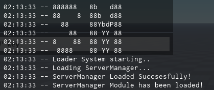

# ServerManager

ServerManager is combination of diffrent modules combined into one script, and added aditonal changes to it making it more usable.

# Developers

 Lead Developer: [Maatijaa](https://github.com/Maatijaa/) (Paradoxer)

# Installation Tutorial

 We highly recommend to only download from this source cause this is original one.

**And always latest version is always suggested!**

*You can find all realeses here:* [ServerManager Realeses](https://github.com/Maatijaa/ServerManager/releases/)

*Step 1: Import your downloaded file .rbxmx into roblox studio*

*Step 2: Setup the module how ever you want it. And boom!*

*Note: Do not edit any part of the scripts if you dont know what are you doing cause it may break a whole module.*

It should look like this:

You can change messages modify it to your use case, and thats it! Make sure to start our project! to support us!

If you can keep credits about this module it would make me happy, because i worked hard on this project.

# Informations

**If you have any questions or would like to suggest something to this project, you can join our** [Discord](https://discord.gg/Dn4RnDu2wS)

**Every day i will try to bring in more features as possible, to make sure to bring most advenced experience to our users.**

*Thank you for Reading this Information..*

*This project has been ended. And will be probably not maintained anymore, feel free to fork it just please give Credits to the original creator Maatijaa.*
